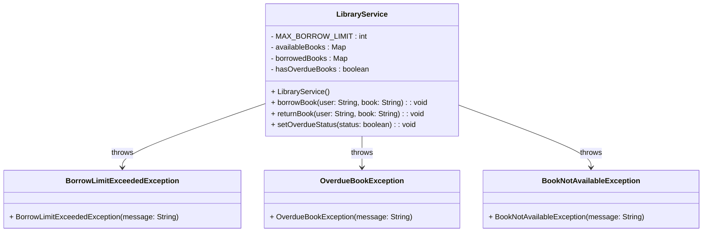
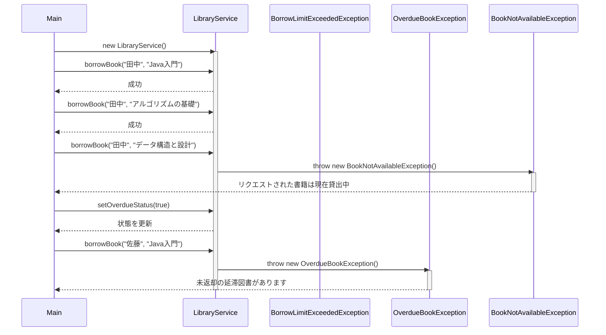

## Javaで独自例外を実装する例
図書館における貸し出しサービスにて、次に示す状況を例外として実装する例。

- 貸し出し制限超過: 利用者が同時に借りられる最大冊数を超えて本を借りようとした場合。
- 延滞未返却: 利用者が延滞している本を返却しないまま新しい本を借りようとした場合。
- 本の在庫切れ: 借りたい本がすべて貸し出されている場合。

### クラス図

- LibraryService
- 例外クラス
    - BorrowLimitExceededException: 貸し出し制限超過
    - OverdueBookException: 延滞未返却
    - BookNotAvailableException: 本の在庫切れ

### シーケンス図

- オブジェクト生成
    - LibraryServiceオブジェクトがMainクラスで生成されます。
- 貸し出し処理
    - LibraryServiceに対して複数のborrowBookメソッドが呼び出されます。
    - 最初の2つは成功し、結果が返されます。
- 例外発生
    - "データ構造と設計"を借りようとするとBookNotAvailableExceptionがスローされ、例外メッセージがMainに返されます。
- 状態更新
    - setOverdueStatus(true)を呼び出し、延滞状態を設定します。
- 延滞チェック
    - その後、"佐藤"が本を借りようとするとOverdueBookExceptionがスローされ、例外メッセージが返されます。
